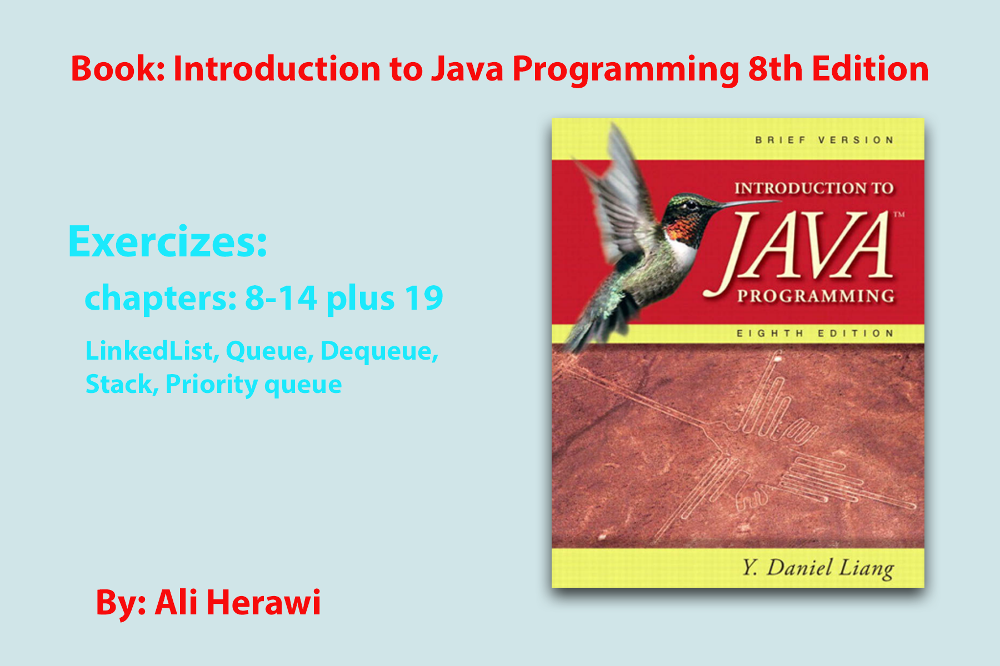

# Java se Intro to java programming 8th book Exercizes
 Java se Introduction to java programming book Exercizes solutions
 chapters: 8, 9 10 , 11, 12, 13, 14 and 19
 LinkedList, Queue, Dequeue, 
 stack, Priority queue

 

# getting started

**1. clone from Github**
 `git clone https://github.com/Aliherawi7/Intro.to.Java.Programming.8th-Exercizes.git`

# Would you like to help and support me?
* Star Github repository
* ...
